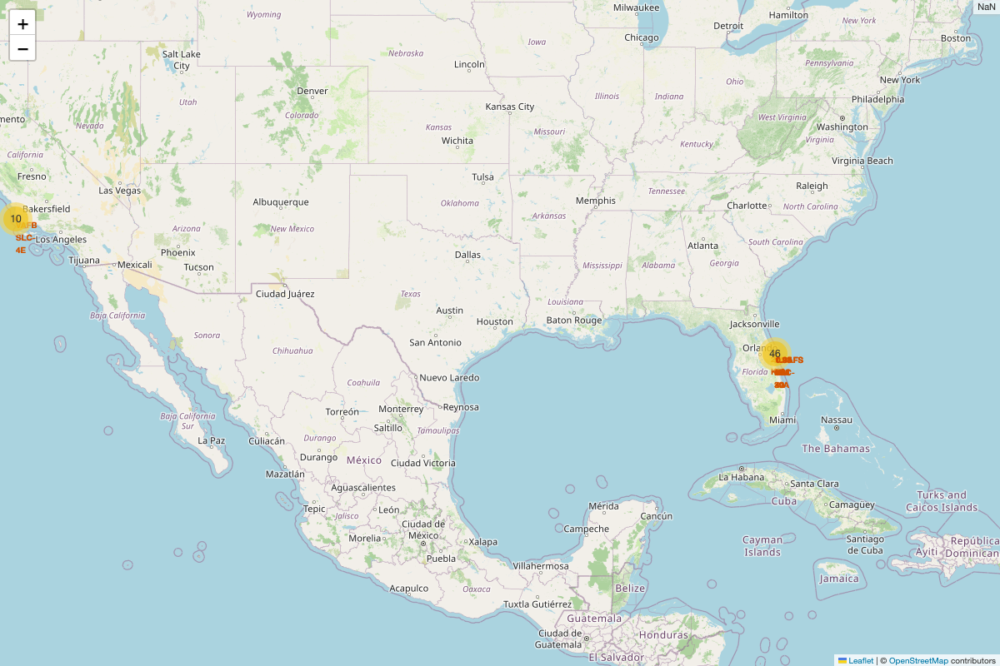
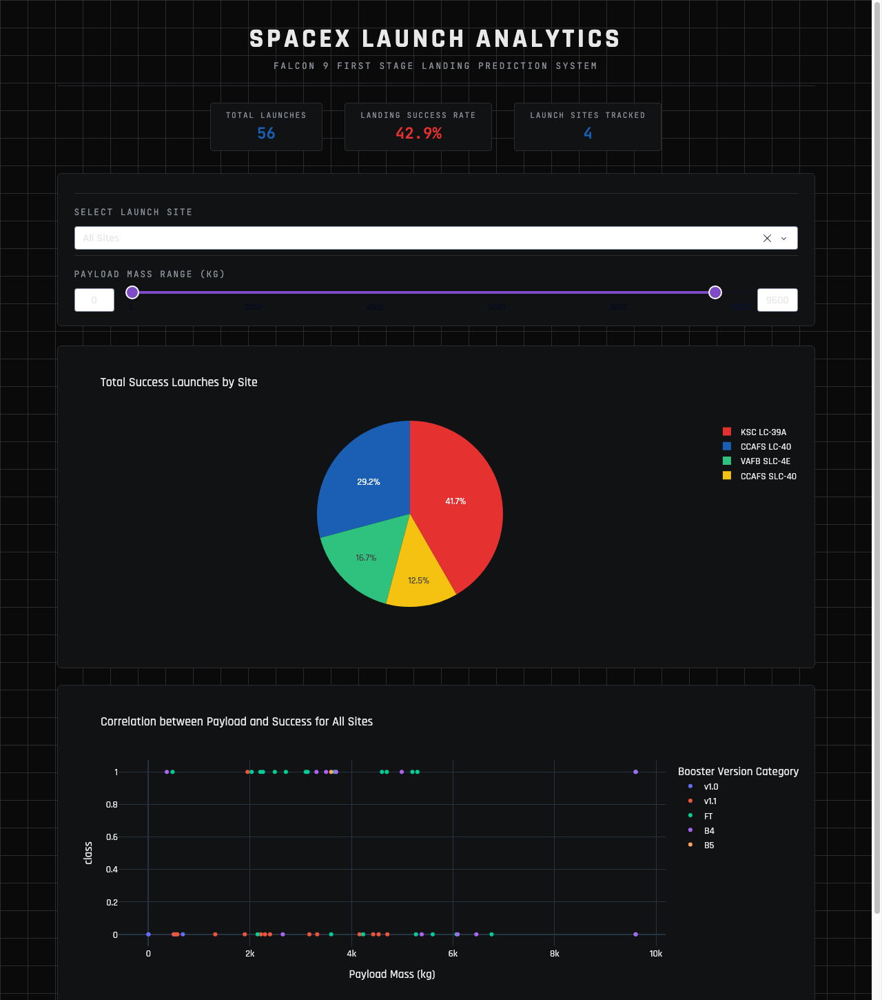

# SpaceX Falcon 9 — First Stage Landing Prediction

[](https://github.com/AdriaRM96/spacex-falcon9-capstone/actions/workflows/notebooks.yml)

Predicting whether a Falcon 9 first stage will land successfully, and using that prediction to estimate what a SpaceX launch really costs.

**[Live dashboard →](https://spacex-falcon9-dashboard.onrender.com)** *(spins up on first visit after idling — give it ~30s; see [Interactive dashboard](#interactive-dashboard) below to deploy your own copy)*

## Why this project

SpaceX advertises Falcon 9 launches at around $62M, well under the $165M+ typical of competitors. The gap comes almost entirely from one thing: SpaceX reuses the first stage instead of throwing it away after every flight. If a competitor — or an analyst, investor, or space enthusiast — wants to understand SpaceX's real cost structure, the question that matters isn't "how much does a Falcon 9 launch cost on paper," it's **"how likely is that first stage to come back in one piece?"**

That's the question this project answers end to end: pulling raw launch data from scratch, cleaning it into something usable, exploring what actually drives a successful landing, building a model that predicts it, and translating that prediction into what a given mission is actually expected to cost.

## What's inside

The project follows a full data science workflow, from raw data to a working prediction model:

| Stage | Notebook | What it does |
|---|---|---|
| 1. Collect | [`01_data_collection_api.ipynb`](notebooks/01_data_collection_api.ipynb) | Pulls launch, rocket, payload, and core data from the public SpaceX REST API. |
| 2. Collect | [`02_data_collection_webscraping.ipynb`](notebooks/02_data_collection_webscraping.ipynb) | Scrapes the historical Falcon 9/Falcon Heavy launch table from Wikipedia with BeautifulSoup, as a second, independent data source. |
| 3. Wrangle | [`03_data_wrangling.ipynb`](notebooks/03_data_wrangling.ipynb) | Merges both sources and engineers the binary landing-success label (`Class`) that everything downstream is trained on. |
| 4. Explore | [`04_eda_sql.ipynb`](notebooks/04_eda_sql.ipynb) | SQL-driven exploration (SQLite) — launch sites, payload totals, mission outcomes, booster history. |
| 5. Explore | [`05_eda_dataviz.ipynb`](notebooks/05_eda_dataviz.ipynb) | Visual EDA — how flight number, payload mass, and orbit relate to landing success — plus feature engineering for modeling. |
| 6. Geolocate | [`06_launch_site_location_folium.ipynb`](notebooks/06_launch_site_location_folium.ipynb) | Interactive map of launch sites and their proximity to coastlines, railways, and highways. |
| 7. Predict | [`07_machine_learning_prediction.ipynb`](notebooks/07_machine_learning_prediction.ipynb) | Tunes Logistic Regression, SVM, Decision Tree, KNN, and XGBoost (`GridSearchCV`), compares them with 10-fold `StratifiedKFold`, explains the winner with SHAP/permutation importance, translates landing probability into expected launch cost, and retrains on the extended 2020-2026 dataset from Notebook 8. |
| 8. Refresh | [`08_data_refresh.ipynb`](notebooks/08_data_refresh.ipynb) | Scrapes live Wikipedia launch tables for everything since the original dataset's 2020-11-13 cutoff and combines them into a 7.5x larger dataset. |

> **A note on Notebook 1:** the public SpaceX API (`api.spacexdata.com`) has had recurring outages. The notebook tries the live API first and falls back to a frozen local snapshot ([`data/raw/`](data/raw/)) if it's unreachable, so it runs end to end either way — verified by actually triggering the fallback path.



## Interactive dashboard

[`dashboard/spacex-dash-app.py`](dashboard/spacex-dash-app.py) is a [Plotly Dash](https://dash.plotly.com/) app for exploring the results interactively — filter by launch site, scan a pie chart of successful launches, slide through payload mass ranges against landing outcome, or get a real prediction for a hypothetical launch from the Predict panel.



**Run it locally:**

```bash
pip install -r dashboard/requirements.txt
pip install -e .
python -m spacex_capstone.train_and_export dashboard/model_artifact.joblib
cd dashboard
python spacex-dash-app.py
```

Then open `http://127.0.0.1:8050/`.

### Live prediction endpoint

The Predict panel calls a plain Flask route (`/predict`) on the same server Dash runs on — no separate API service, just one extra endpoint alongside the dashboard's own routing. It's backed by the calibrated SVM from `07_machine_learning_prediction.ipynb`, trained on the original 90-launch dataset (not the extended 672-launch one — see [Model limitations](#model-limitations)).

```bash
curl "http://127.0.0.1:8050/predict?payload_mass=4000&orbit=ISS&launch_site=CCAFS%20SLC%2040"
# {"payload_mass": 4000.0, "orbit": "ISS", "launch_site": "CCAFS SLC 40", "p_success": 0.6925, "expected_cost_usd": 93675131.29}
```

Valid `orbit` values: `ES-L1`, `GEO`, `GTO`, `HEO`, `ISS`, `LEO`, `MEO`, `PO`, `SO`, `SSO`, `VLEO`. Valid `launch_site` values: `CCAFS SLC 40`, `KSC LC 39A`, `VAFB SLC 4E`.

The model artifact is trained at build/start time by [`src/spacex_capstone/train_and_export.py`](src/spacex_capstone/train_and_export.py) rather than committed to the repo — training takes seconds on this dataset, so there's no cost to regenerating it, and it can't silently drift out of sync with the notebook the way a committed binary could.

**Deploy it for free (Render):**

No account secrets or environment variables are needed — the app only reads a CSV that ships in this repo, and trains its own model artifact at build time.

1. Fork or push this repo to your own GitHub account.
2. On [render.com](https://render.com), click **New +** → **Blueprint**, connect the repo. Render reads [`render.yaml`](render.yaml) automatically and provisions the service.
3. Click **Apply** / **Deploy**. That's it — one deploy, no CLI.

If Blueprint deploys aren't available on your plan, deploy manually instead: **New +** → **Web Service** → connect the repo → set **Build Command** to `pip install -r dashboard/requirements.txt && pip install -e . && python -m spacex_capstone.train_and_export dashboard/model_artifact.joblib` and **Start Command** to `gunicorn spacex-dash-app:server --chdir dashboard`.

The free tier spins the service down after 15 minutes of inactivity (expect a ~30s cold start on the next visit) — fine for a portfolio piece, not for production traffic.

## Reproducibility & code quality

- **[`requirements.txt`](requirements.txt)** pins the exact versions everything was actually run with.
- **[`.github/workflows/notebooks.yml`](.github/workflows/notebooks.yml)** re-executes all seven notebooks end to end on every push (`papermill`), and runs the test suite — both have to pass for the badge above to stay green.
- **[`src/spacex_capstone/`](src/spacex_capstone)** holds the reusable logic (data loading/cleaning, feature engineering, model tuning/evaluation, plotting) that the notebooks import instead of redefining inline, with **16 pytest tests** ([`tests/`](tests)) covering the label construction, API-fallback behavior, and data cleaning.
- **[`data/raw/`](data/raw)** freezes a snapshot of both external sources (SpaceX API response, Wikipedia HTML), so the pipeline doesn't depend on either staying online.

## Data

`data/` holds what powers the SQL notebook, the dashboard, and the Folium map:
- `spacex_launch_dash.csv` — dashboard data
- `spacex_launch_geo.csv` — launch site coordinates
- `my_data1.db` — SQLite database used for the SQL exploration
- `raw/` — frozen snapshots of the SpaceX API and Wikipedia sources (see [`data/raw/README.md`](data/raw/README.md))
- `dataset_part_1_extended.csv` / `dataset_part_3_extended.csv` — the 672-launch dataset from `08_data_refresh.ipynb` (cleaned launches, and its one-hot encoded feature table)

## What I found

- **Landing success climbed fast.** From effectively 0% between 2010–2014 to 77.8% by 2017 — the clearest signal of SpaceX iterating its recovery process in real time.
- **Site matters.** KSC LC-39A leads with a 76.9% success rate; CCAFS LC-40, used more in the program's early years, trails at 26.9%.
- **Heavier payloads land less reliably.** Across sites and orbits, landing success drops as payload mass increases — physics, not chance.
- **Geography isn't an accident.** Every launch site sits within ~1 km of the coast, keeping failed landings and aborts over water instead of populated land.
- **SVM wins on a robust comparison.** A single 80/20 split (18 test samples) isn't enough data to reliably rank models — one flipped prediction moves accuracy by ~5.6 points. Under 10-fold `StratifiedKFold` (mean accuracy across folds), **SVM leads at 85.6%**, ahead of KNN (84.4%), Logistic Regression (83.3%), XGBoost (81.1%), and Decision Tree (80.0%).
- **The winning model's feature importance is a warning sign, not a clean signal.** Permutation importance on SVM (the CV winner) is dominated by individual `Serial`/`LandingPad` one-hot columns with tiny effect sizes (largest ≈0.011) rather than physically meaningful features like `PayloadMass` or `Orbit`. That's a direct symptom of the 83-feature/90-sample overfitting risk flagged in the notebook's limitations section — with this little data, a model can key off near-unique booster identifiers instead of learning a generalizable pattern.
- **Landing probability translates directly to cost.** Mapping each scenario's predicted success probability onto SpaceX's advertised $62M (reused) / $165M (expendable) prices, expected launch cost ranges from ~$81M for a light LEO payload to ~$94M for a medium payload to ISS orbit — see the [business-impact section](notebooks/07_machine_learning_prediction.ipynb) for the full scenario comparison and its caveats.
- **More data revealed a sharper problem, not a solved one.** Extending the dataset to 672 launches (2010-2026, via `08_data_refresh.ipynb`) pushed the landing success rate to 93.9% — genuine progress, not noise. But retraining SVM on it exposed something the original 90-launch model's metrics had papered over: the "best" model by cross-validated accuracy turned out to predict *success for every single test launch*, a hollow win driven entirely by class imbalance (only 8 failures in 135 test samples). Neither re-tuning with `f1` scoring nor `class_weight='balanced'` fixed it — the latter just flipped which constant it predicted. That's a more honest, more specific failure mode than the original dataset's diffuse overfitting risk, and a clearer target for future work (see [Model limitations](#model-limitations) below).

## Model limitations

The deployed model (dashboard Predict panel, `/predict`) trains on the **original 90-launch dataset** (2010–2020-11-13), not the larger one — see why below. It's evaluated with 10-fold `StratifiedKFold` (mean ± std across folds) rather than a single train/test split, because 18 test samples aren't enough to reliably tell two models apart: one flipped prediction swings accuracy by ~5.6 points, and a single split can't distinguish a good model from a lucky one. Even so, the winning SVM's permutation importance is dominated by near-unique `Serial`/`LandingPad` identifier columns rather than physically meaningful features — a direct symptom of having 83 features for only 90 samples. Extending to 672 launches (`08_data_refresh.ipynb`) didn't fix this so much as trade it for a different problem: with landing failures now rare (93.9% success), a plain accuracy-optimized SVM collapses to predicting the majority class outright. Both point the same direction — **the real constraint is too few *failures* to learn from, not too few launches** — and both are why the deployed model is the smaller-but-real one rather than the larger-but-degenerate one.

## Stack

Python · pandas · scikit-learn · XGBoost · SHAP · SQLite · BeautifulSoup · Folium · Plotly Dash · matplotlib/seaborn · pytest · GitHub Actions · Render

## What's next

- Fix the class-imbalance problem the extended dataset surfaced — oversampling (SMOTE), a wider `class_weight` sweep, or simply more accumulated failures over time.
- Add booster-specific reuse count as a feature — a booster on its 10th flight likely behaves differently than one on its 1st.
- Swap the static dashboard filters for a live-refreshing feed once the SpaceX API recovers (it's been down throughout this project).
- Replace the marketing-figure cost model in the business-impact section with a more granular cost breakdown, if SpaceX or a comparable provider ever publishes one.
